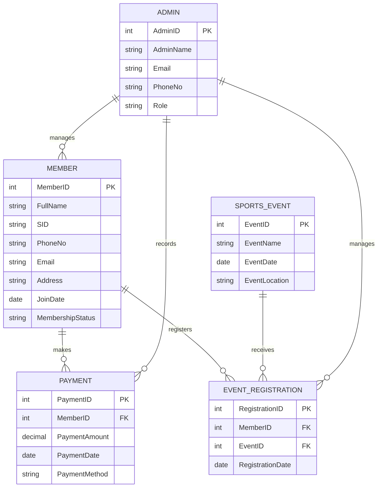
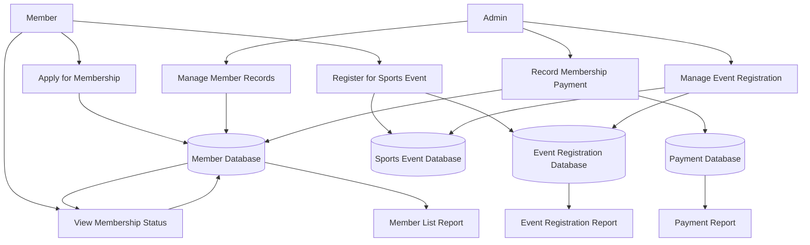

## Project Overview

The Membership System is designed to manage member records, membership fee payments, and sports event registrations in an organized and efficient way. The system supports both administrators and members. Administrators manage member data and event registrations, while members can apply for membership, join sports events, and check their membership status.

## User Roles

### Admin

The administrator is responsible for managing the daily operations of the membership system. The main functions include:

- Register new members
- Update member information
- Record membership fee payments
- View the member list
- Manage sports event registrations

### Members

Members are the end users of the system. Their main functions include:

- Apply for membership
- Register for sports events, activities, or competitions
- View membership status

## System Functions

The membership system should provide the following functions:

1. Member registration for new applicants
2. Member information update for existing records
3. Membership fee payment recording
4. Member list viewing for administrative use
5. Sports event registration management
6. Membership status checking for members

## Data Stored by the System

The system should store the following categories of information.

### 1. Member Information

- Member ID
- Full Name
- SID
- Phone Number
- Email
- Address
- Join Date
- Membership Status

### 2. Payment Information

- Payment ID
- Member ID
- Payment Amount
- Payment Date
- Payment Method

### 3. Sports Event Information

- Event ID
- Event Name
- Event Date
- Event Location

### 4. Event Registration Information

- Registration ID
- Member ID
- Event ID
- Registration Date

### 5. Admin Information

- Admin ID
- Admin Name
- Email
- Phone Number
- Role

## Input Forms

To collect and manage data, the system should include the following input forms.

### 1. Membership Application Form

This form collects:

- Name
- SID
- Phone Number
- Email
- Address

### 2. Membership Fee Payment Form

This form collects:

- Member ID
- Payment Amount
- Payment Date
- Payment Method

### 3. Sports Event Registration Form

This form collects:

- Member ID
- Event Name
- Registration Date

## Expected Outputs

The system should also produce useful outputs for users and administrators, such as:

- Member list report
- Membership status display
- Payment record report
- Sports event list
- Event registration list

## Suggested Database Tables

Based on the required data, the system can be designed with the following tables.

### Member

| Field Name | Description |
| --- | --- |
| MemberID | Unique identifier for each member |
| FullName | Member's full name |
| SID | Student or staff identification number |
| PhoneNo | Contact number |
| Email | Email address |
| Address | Home address |
| JoinDate | Date the member joined |
| MembershipStatus | Current status of membership |

### Payment

| Field Name | Description |
| --- | --- |
| PaymentID | Unique identifier for each payment |
| MemberID | Member who made the payment |
| PaymentAmount | Amount paid |
| PaymentDate | Date of payment |
| PaymentMethod | Payment method used |

### SportsEvent

| Field Name | Description |
| --- | --- |
| EventID | Unique identifier for each event |
| EventName | Name of the event |
| EventDate | Date of the event |
| EventLocation | Location of the event |

### EventRegistration

| Field Name | Description |
| --- | --- |
| RegistrationID | Unique identifier for each registration |
| MemberID | Member joining the event |
| EventID | Event being registered for |
| RegistrationDate | Date of registration |

### Admin

| Field Name | Description |
| --- | --- |
| AdminID | Unique identifier for each admin |
| AdminName | Full name of the admin |
| Email | Admin email address |
| PhoneNo | Contact number |
| Role | Position or responsibility |

## Primary Keys and Foreign Keys

The key structure of the database can be defined as follows:

- `Member.MemberID` is the primary key of the Member table
- `Payment.PaymentID` is the primary key of the Payment table
- `SportsEvent.EventID` is the primary key of the SportsEvent table
- `EventRegistration.RegistrationID` is the primary key of the EventRegistration table
- `Admin.AdminID` is the primary key of the Admin table
- `Payment.MemberID` is a foreign key referencing `Member.MemberID`
- `EventRegistration.MemberID` is a foreign key referencing `Member.MemberID`
- `EventRegistration.EventID` is a foreign key referencing `SportsEvent.EventID`

## Business Rules

The system should follow these business rules:

- Each member must have a unique Member ID
- Each payment must be linked to one member only
- A member can make many payments over time
- A member can register for many sports events
- Each event registration must link one member and one event
- Only authorized admins can add, update, or manage records
- Membership status should be updated based on payment records

## <span style="color:#d97706">[NEW] ER Diagram</span>

The following Entity-Relationship Diagram shows the main entities and relationships in the membership system.



## <span style="color:#d97706">[NEW] Data Flow Diagram</span>

The following Data Flow Diagram shows how data moves between users, processes, and data stores.



## <span style="color:#d97706">[NEW] Normalization Discussion</span>

The database design should follow normalization rules to reduce data redundancy and improve consistency.

### First Normal Form (1NF)

The tables satisfy First Normal Form because:

- Each field stores only one value
- There are no repeating groups in a single table
- Each record can be uniquely identified by a primary key

### Second Normal Form (2NF)

The tables satisfy Second Normal Form because:

- All non-key attributes depend on the whole primary key
- The design separates member, payment, event, and registration data into different tables
- In `EventRegistration`, the non-key attribute `RegistrationDate` depends on the registration record

### Third Normal Form (3NF)

The tables satisfy Third Normal Form because:

- Non-key attributes depend only on the primary key
- Member details are stored only in the `Member` table
- Event details are stored only in the `SportsEvent` table
- Payment details are stored only in the `Payment` table
- This reduces duplication and prevents update anomalies

## <span style="color:#d97706">[NEW] SQL CREATE TABLE Statements</span>

The following SQL statements can be used to create the database tables.

```sql
CREATE TABLE Admin (
    AdminID INT PRIMARY KEY,
    AdminName VARCHAR(100) NOT NULL,
    Email VARCHAR(100) NOT NULL,
    PhoneNo VARCHAR(20),
    Role VARCHAR(50) NOT NULL
);

CREATE TABLE Member (
    MemberID INT PRIMARY KEY,
    FullName VARCHAR(100) NOT NULL,
    SID VARCHAR(30) NOT NULL UNIQUE,
    PhoneNo VARCHAR(20),
    Email VARCHAR(100) NOT NULL,
    Address VARCHAR(255),
    JoinDate DATE NOT NULL,
    MembershipStatus VARCHAR(30) NOT NULL
);

CREATE TABLE Payment (
    PaymentID INT PRIMARY KEY,
    MemberID INT NOT NULL,
    PaymentAmount DECIMAL(10,2) NOT NULL,
    PaymentDate DATE NOT NULL,
    PaymentMethod VARCHAR(50) NOT NULL,
    FOREIGN KEY (MemberID) REFERENCES Member(MemberID)
);

CREATE TABLE SportsEvent (
    EventID INT PRIMARY KEY,
    EventName VARCHAR(100) NOT NULL,
    EventDate DATE NOT NULL,
    EventLocation VARCHAR(100) NOT NULL
);

CREATE TABLE EventRegistration (
    RegistrationID INT PRIMARY KEY,
    MemberID INT NOT NULL,
    EventID INT NOT NULL,
    RegistrationDate DATE NOT NULL,
    FOREIGN KEY (MemberID) REFERENCES Member(MemberID),
    FOREIGN KEY (EventID) REFERENCES SportsEvent(EventID)
);
```

## <span style="color:#d97706">[NEW] Sample Queries and Reports</span>

The following sample queries can be used to retrieve useful information from the system.

### Query 1: View All Members

```sql
SELECT MemberID, FullName, SID, PhoneNo, Email, MembershipStatus
FROM Member;
```

### Query 2: View Payment Records of All Members

```sql
SELECT PaymentID, MemberID, PaymentAmount, PaymentDate, PaymentMethod
FROM Payment;
```

### Query 3: View Sports Events

```sql
SELECT EventID, EventName, EventDate, EventLocation
FROM SportsEvent;
```

### Query 4: View Event Registration Details

```sql
SELECT er.RegistrationID, m.FullName, se.EventName, er.RegistrationDate
FROM EventRegistration er
JOIN Member m ON er.MemberID = m.MemberID
JOIN SportsEvent se ON er.EventID = se.EventID;
```

### Query 5: View Members with Active Membership Status

```sql
SELECT MemberID, FullName, MembershipStatus
FROM Member
WHERE MembershipStatus = 'Active';
```

### Suggested Reports

The system can generate the following reports:

- Member list report
- Membership status report
- Payment transaction report
- Sports event schedule report
- Event registration summary report

## Relationship Overview

The main relationships in the system are:

- One member can have many payment records
- One member can register for many sports events
- One sports event can have many member registrations
- Each event registration links one member with one sports event
- Admins manage members, payments, and event registrations

## Conclusion

In conclusion, this Membership System provides a clear structure for managing members, payments, and sports event registrations. It supports both administrative tasks and member services. By using a database system, the organization can store information accurately, reduce manual work, and improve the efficiency of membership management.

## Reference Notes


