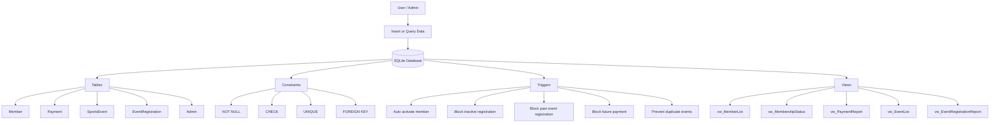
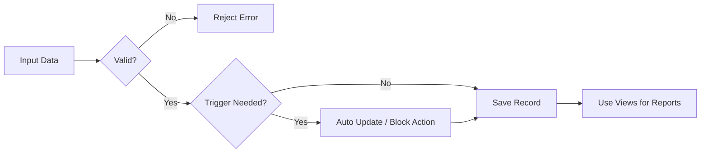
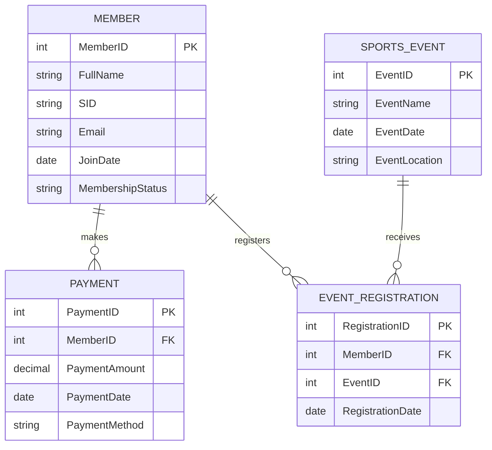
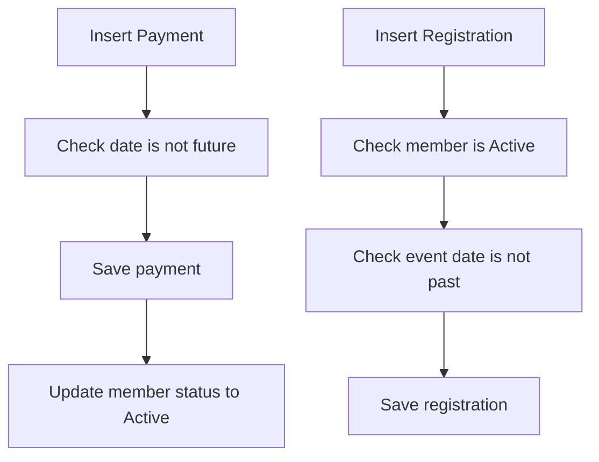

# Mermaid Architecture Diagram

## 1. Overall System

```mermaid
flowchart TD
    U[User / Admin] --> A[Insert or Query Data]
    A --> B[(SQLite Database)]

    B --> T[Tables]
    B --> C[Constraints]
    B --> G[Triggers]
    B --> V[Views]

    T --> T1[Member]
    T --> T2[Payment]
    T --> T3[SportsEvent]
    T --> T4[EventRegistration]
    T --> T5[Admin]

    C --> C1[NOT NULL]
    C --> C2[CHECK]
    C --> C3[UNIQUE]
    C --> C4[FOREIGN KEY]

    G --> G1[Auto activate member]
    G --> G2[Block inactive registration]
    G --> G3[Block past event registration]
    G --> G4[Block future payment]
    G --> G5[Prevent duplicate events]

    V --> V1[vw_MemberList]
    V --> V2[vw_MembershipStatus]
    V --> V3[vw_PaymentReport]
    V --> V4[vw_EventList]
    V --> V5[vw_EventRegistrationReport]
```

## 2. Data Workflow

```mermaid
flowchart LR
    A[Input Data] --> B{Valid?}
    B -- No --> C[Reject Error]
    B -- Yes --> D{Trigger Needed?}
    D -- Yes --> E[Auto Update / Block Action]
    D -- No --> F[Save Record]
    E --> F
    F --> G[Use Views for Reports]
```

## 3. Main Relationships

```mermaid
erDiagram
    MEMBER ||--o{ PAYMENT : makes
    MEMBER ||--o{ EVENT_REGISTRATION : registers
    SPORTS_EVENT ||--o{ EVENT_REGISTRATION : receives

    MEMBER {
        int MemberID PK
        string FullName
        string SID
        string Email
        date JoinDate
        string MembershipStatus
    }

    PAYMENT {
        int PaymentID PK
        int MemberID FK
        decimal PaymentAmount
        date PaymentDate
        string PaymentMethod
    }

    SPORTS_EVENT {
        int EventID PK
        string EventName
        date EventDate
        string EventLocation
    }

    EVENT_REGISTRATION {
        int RegistrationID PK
        int MemberID FK
        int EventID FK
        date RegistrationDate
    }
```

## 4. Trigger Logic Flow

```mermaid
flowchart TD
    P[Insert Payment] --> P1[Check date is not future]
    P1 --> P2[Save payment]
    P2 --> P3[Update member status to Active]

    R[Insert Registration] --> R1[Check member is Active]
    R1 --> R2[Check event date is not past]
    R2 --> R3[Save registration]
```
