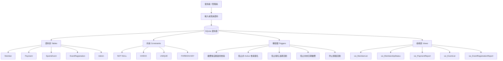
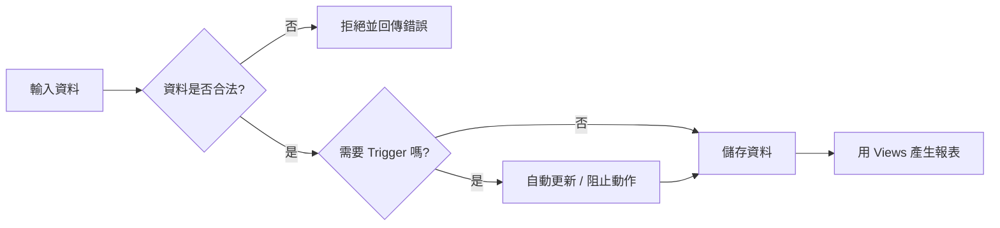
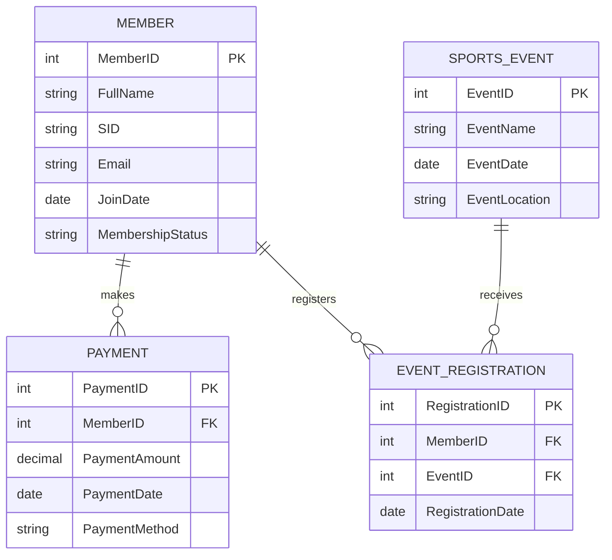
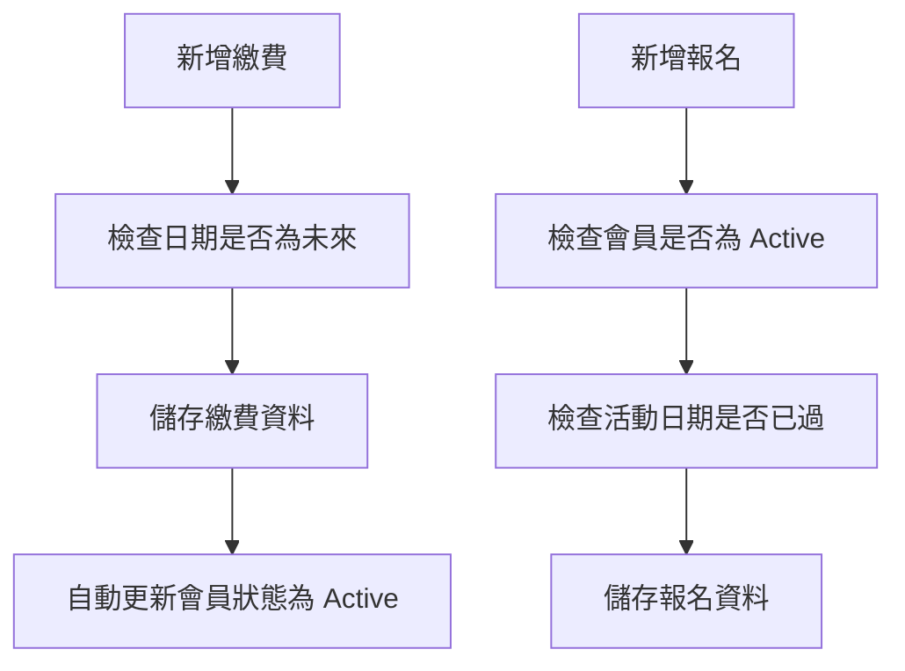

# Mermaid 架構圖

## 1. 整體系統架構

```mermaid
flowchart TD
    U[使用者 / 管理員] --> A[輸入或查詢資料]
    A --> B[(SQLite 資料庫)]

    B --> T[資料表 Tables]
    B --> C[約束 Constraints]
    B --> G[觸發器 Triggers]
    B --> V[檢視表 Views]

    T --> T1[Member]
    T --> T2[Payment]
    T --> T3[SportsEvent]
    T --> T4[EventRegistration]
    T --> T5[Admin]

    C --> C1[NOT NULL]
    C --> C2[CHECK]
    C --> C3[UNIQUE]
    C --> C4[FOREIGN KEY]

    G --> G1[繳費後自動啟用會員]
    G --> G2[阻止非 Active 會員報名]
    G --> G3[阻止報名過期活動]
    G --> G4[阻止未來日期繳費]
    G --> G5[防止重複活動]

    V --> V1[vw_MemberList]
    V --> V2[vw_MembershipStatus]
    V --> V3[vw_PaymentReport]
    V --> V4[vw_EventList]
    V --> V5[vw_EventRegistrationReport]
```

## 2. 資料流工作流程

```mermaid
flowchart LR
    A[輸入資料] --> B{資料是否合法?}
    B -- 否 --> C[拒絕並回傳錯誤]
    B -- 是 --> D{需要 Trigger 嗎?}
    D -- 是 --> E[自動更新 / 阻止動作]
    D -- 否 --> F[儲存資料]
    E --> F
    F --> G[用 Views 產生報表]
```

## 3. 主要關聯圖

```mermaid
erDiagram
    MEMBER ||--o{ PAYMENT : makes
    MEMBER ||--o{ EVENT_REGISTRATION : registers
    SPORTS_EVENT ||--o{ EVENT_REGISTRATION : receives

    MEMBER {
        int MemberID PK
        string FullName
        string SID
        string Email
        date JoinDate
        string MembershipStatus
    }

    PAYMENT {
        int PaymentID PK
        int MemberID FK
        decimal PaymentAmount
        date PaymentDate
        string PaymentMethod
    }

    SPORTS_EVENT {
        int EventID PK
        string EventName
        date EventDate
        string EventLocation
    }

    EVENT_REGISTRATION {
        int RegistrationID PK
        int MemberID FK
        int EventID FK
        date RegistrationDate
    }
```

## 4. Trigger 邏輯流程

```mermaid
flowchart TD
    P[新增繳費] --> P1[檢查日期是否為未來]
    P1 --> P2[儲存繳費資料]
    P2 --> P3[自動更新會員狀態為 Active]

    R[新增報名] --> R1[檢查會員是否為 Active]
    R1 --> R2[檢查活動日期是否已過]
    R2 --> R3[儲存報名資料]
```
